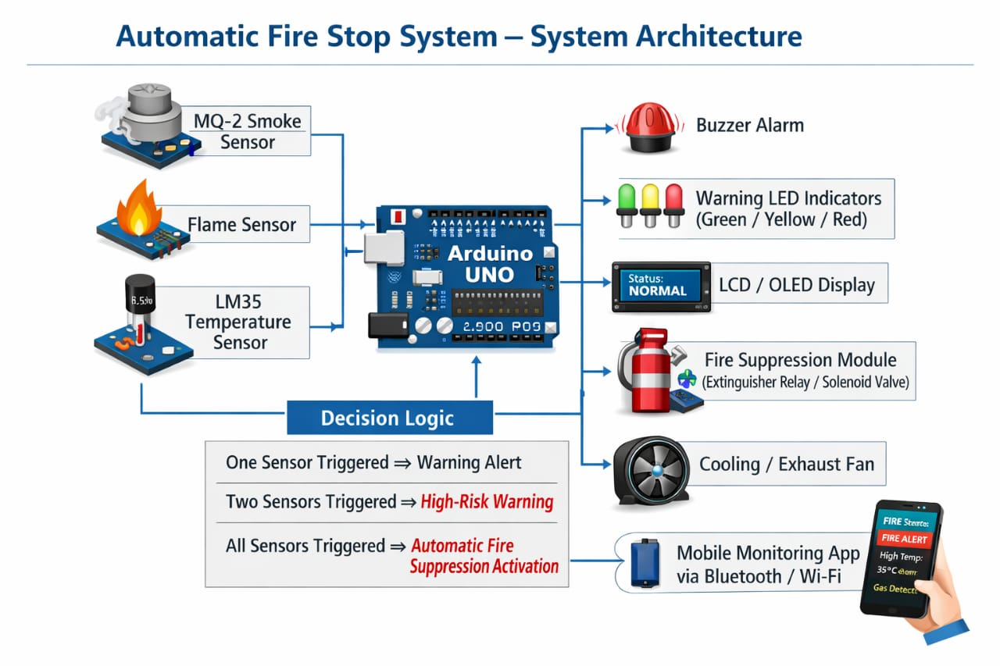

# 🔥 Automatic Fire Stop System

## Overview

The Automatic Fire Stop System is an Arduino-based fire detection and suppression solution designed to identify potential fire hazards using multiple sensors and automatically activate a fire suppression mechanism when a fire is confirmed.

The system uses a combination of smoke, temperature, and flame sensors to reduce false alarms and improve detection accuracy.

---

## Features

* Real-time fire monitoring
* Multi-sensor fire detection
* Automatic fire suppression activation
* Warning alerts for potential fire risks
* Reduced false alarms through sensor verification logic
* Suitable for battery storage systems, workshops, laboratories, and industrial environments

## System Logic

| Sensor Status                         | System Action                                        |
| ------------------------------------- | ---------------------------------------------------- |
| One sensor triggered                  | Warning alert                                        |
| Two sensors triggered                 | High-risk warning                                    |
| Smoke + Temperature + Flame triggered | Activate fire suppression system and emergency alarm |

## Hardware Components

* Arduino Uno
* MQ-2 Smoke Sensor
* Flame Sensor
* LM35 Temperature Sensor
* Buzzer
* Relay Module
* Fire Suppression Mechanism (Pump/Solenoid Valve)
* LEDs
* Power Supply

---

## Arduino Hardware Wiring

*Figure 1: Complete Arduino hardware wiring diagram.*

## System Architecture

*Figure 2: System architecture showing sensor inputs, decision-making logic, alerts, and suppression control.*

## Working Principle

1. Sensors continuously monitor environmental conditions.
2. Arduino collects data from all sensors.
3. Detection logic evaluates the fire risk level.
4. If one or two sensors are activated, a warning is issued.
5. If all three sensors are activated simultaneously, the system confirms a fire event.
6. The relay activates the fire suppression mechanism.
7. Audible and visual alarms notify nearby personnel.

## Future Improvements
* Design of the Fire Supression part of System
* ESP32 Wi-Fi connectivity
* Mobile application monitoring
* SMS and email notifications
* Cloud data logging
* Battery backup system

## Author

**Dennis Kyule Muli**

Electrical and Electronics Engineering Student | Embedded Systems Developer
